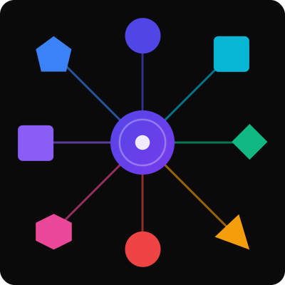

# NexusDynamic

<table vspace="50" style="width: 100%; border: none;" cellspacing="0" cellpadding="0" border="0">
  <tr>
    <td><strong>Multimodal group social dynamics research for everyone</strong>
        
This project and collection of packages has the goal of creating a group-first, cross-platform suite of tools that make it easy to start collecting behavioural, EEG, MoCap or any other data source that either already has an integration with [Lab Streaming Layer](https://labstreaminglayer.org/), or, any kind of API for consuming data, which can then be collected or forwarded on as an LSL stream.</td>
    <td width="50%"></td>
</table>

  

> [!TIP]
> For a quick overview, see the <a href="https://github.com/NexusDynamic/.github/blob/main/profile/FINAL-Coop_comp_paradigm-A0Poster_reduced.pdf">poster</a>

**Does this already sound too complicated?**

Don't worry, it is still early days, but already some basic functionality, such as validating latency and timing in your lab, is already as simple as running an app on whatever devices you plan to use in research.

   

## Project Components

### Core

The core of this project is the [Dart native liblsl wrapper](https://github.com/NexusDynamic/liblsl.dart/tree/main/packages/liblsl) which makes LSL integration into your project a breeze.

This already supports Android, iOS, Linux, MacOS and Windows.

#### Device Specific Libraries

While it's pretty easy to get the liblsl dart native library working in most environments, sometimes a little extra effort is required, and as such, there is a liblsl [pre-compiled build for the Bela](https://github.com/NexusDynamic/Bela-liblsl) (Beaglebone black) availabe

### Add-on Packages

#### Timing and Latency Analysis

- [liblsl_timing](https://github.com/NexusDynamic/liblsl.dart/tree/main/packages/liblsl_timing): App based multi-device latency, sync and interactive timing tests with automatic device coordination via LSL
- [liblsl_analysis](https://github.com/NexusDynamic/liblsl.dart/tree/main/packages/liblsl_analysis): Analysis of results from the timing tests in [liblsl_timing](https://github.com/NexusDynamic/liblsl.dart/tree/main/packages/liblsl_timing)

If you have a [Bela](https://bela.io/),  [code is available](https://github.com/NexusDynamic/bela-lsl-timing) to validate the end-to-end latency of devices using photodiodes and FSR sensors.

## Experimental Paradigm for Simultaneous Cooperation and Competition

[RiseTogether](https://github.com/NexusDynamic/RiseTogether) is a novel videogame style paradigm for investigating simultaneous collaboration and competition in groups. It is flexible allowing for varying group sizes, and is built around the dart liblsl framework for automatically coordinating and configuring the experiment in different labs, on different devices, with different numbers of participants. For more info see the repository or the poster linked above.

## Related packages

Some useful packages have been developed for Flutter and Dart development which may be useful more generally beyond group research projects and can be added to apps by developers, these are:

- [flutter_multicast_lock](https://pub.dev/packages/flutter_multicast_lock) [source](https://github.com/NexusDynamic/flutter_multicast_lock), a package to acquire multicast locks on Android (but won't break on other platforms)
- [flutter_refresh_rate_control](https://pub.dev/packages/flutter_refresh_rate_control) [source](https://github.com/NexusDynamic/flutter_refresh_rate_control), a package that helps attempt to make android and iOS devices use the highest refresh rate possible for their screen (e.g. ProMotion) and tries to disable Android's Adaptive Refresh Rate (ARR)
